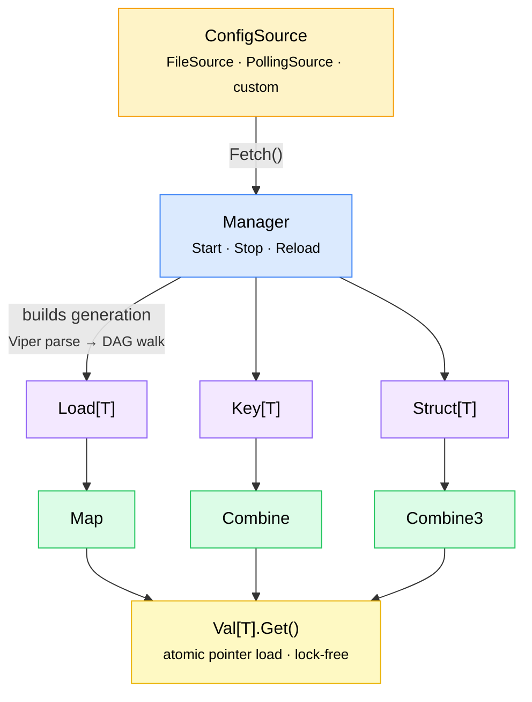

<p align="center">
  
</p>

<h1 align="center">lemonfig</h1>

<p align="center">
  <strong>Reactive, hot-reloadable configuration for Go.</strong>
</p>

<p align="center">
  <a href="https://github.com/lemonberrylabs/lemonfig/actions/workflows/ci.yaml"></a>
  <a href="https://pkg.go.dev/github.com/lemonberrylabs/lemonfig"></a>
  <a href="https://goreportcard.com/report/github.com/lemonberrylabs/lemonfig"></a>
  <a href="LICENSE"></a>
  <a href="https://github.com/lemonberrylabs/lemonfig/releases"></a>
</p>

<p align="center">
  Instead of reading config values as plain structs, you get <code>Val[T]</code> handles that <em>always</em> return the latest value.<br/>
  When config reloads, all derived values are atomically recomputed and swapped in &mdash;<br/>
  including heavy resources like DB pools, HTTP clients, and gRPC connections.
</p>

---

## Why lemonfig?

| Problem | lemonfig solution |
|---|---|
| Config is read once at startup | `Val[T].Get()` always returns the latest value |
| Reload requires restart | Hot-reload via file watching or polling &mdash; zero downtime |
| Stale DB pools after config change | `MapWithCleanup` rebuilds resources and tears down old ones |
| Inconsistent reads during reload | Atomic generation swap &mdash; all values update together |
| Lock contention on hot path | `Get()` is a single atomic pointer load, fully lock-free |

## Install

```bash
go get github.com/lemonberrylabs/lemonfig
```

Requires **Go 1.25+**.

## Quick Start

```go
package main

import (
    "context"
    "fmt"
    "log"

    "github.com/lemonberrylabs/lemonfig"
    "github.com/lemonberrylabs/lemonfig/source"
)

type Config struct {
    Name   string       `mapstructure:"name"`
    Server ServerConfig `mapstructure:"server"`
}

type ServerConfig struct {
    Host string `mapstructure:"host"`
    Port int    `mapstructure:"port"`
}

func main() {
    src := source.NewFileSource("config.yaml")
    mgr, err := lemonfig.NewManager(src)
    if err != nil {
        log.Fatal(err)
    }

    cfg := lemonfig.Load[Config](mgr)

    addr := lemonfig.Map(cfg, func(c Config) (string, error) {
        return fmt.Sprintf("%s:%d", c.Server.Host, c.Server.Port), nil
    })

    if err := mgr.Start(context.Background()); err != nil {
        log.Fatal(err)
    }
    defer mgr.Stop()

    fmt.Println(cfg.Get().Name) // always the latest value
    fmt.Println(addr.Get())     // reactive derived value
}
```

## Core Concepts

### Load & Derive

`Load[T]` loads your full config struct. `Map` derives sub-fields or transforms.

```go
mgr, _ := lemonfig.NewManager(src)
cfg := lemonfig.Load[Config](mgr)

// Extract a sub-field.
env := lemonfig.Map(cfg, func(c Config) (string, error) {
    return c.Environment, nil
})

// Combine multiple values.
addr := lemonfig.Combine(host, port, func(h string, p int) (string, error) {
    return fmt.Sprintf("%s:%d", h, p), nil
})

mgr.Start(ctx)
```

> **Note:** `Map`, `Combine`, and other combinators are package-level functions (not methods)
> because Go does not support methods with additional type parameters.

### Managed Resources with Cleanup

Rebuild heavy resources on config change. Old resources are cleaned up after a grace period.

```go
pool := lemonfig.MapWithCleanup(cfg,
    func(c Config) (*pgxpool.Pool, error) {
        return pgxpool.New(context.Background(), c.Database.URL)
    },
    func(old *pgxpool.Pool) {
        old.Close()
    },
)

mgr.Start(ctx)
defer mgr.Stop() // triggers final cleanup

pool.Get().QueryRow(ctx, "SELECT ...") // always uses the current pool
```

Cleanup runs in reverse topological order after a configurable grace period (default 30s):

```go
lemonfig.WithCleanupGrace(10 * time.Second)
```

### Custom Sources

Implement `ConfigSource` to load config from anywhere:

```go
type HTTPSource struct{ URL string }

func (s *HTTPSource) Fetch(ctx context.Context) ([]byte, string, error) {
    resp, err := http.Get(s.URL)
    if err != nil {
        return nil, "", err
    }
    defer resp.Body.Close()
    data, err := io.ReadAll(resp.Body)
    return data, "json", err
}
```

Wrap with polling for automatic reloads:

```go
src := source.NewPollingSource(&HTTPSource{URL: "https://config.internal/app"}, 30*time.Second)
```

### Advanced: Key-Based Access

For fine-grained control without a root struct:

```go
host := lemonfig.Key[string](mgr, "redis.host")
port := lemonfig.Key[int](mgr, "redis.port")
addr := lemonfig.Combine(host, port, func(h string, p int) (string, error) {
    return fmt.Sprintf("%s:%d", h, p), nil
})
```

## Architecture



**Atomic generation swap:** Every reload computes a new immutable snapshot. All values update together via `atomic.Pointer` — no partial states, no locks on reads.

**All-or-nothing reload:** If any step fails (fetch, parse, validate, transform), the old generation is preserved. No partial updates ever reach consumers.

**DAG frozen at Start:** All `Load`/`Map`/`Combine` registrations must happen before `mgr.Start()`. This keeps the implementation simple and race-free.

## Logging

Pass a logger via `WithLogger`. The library defines a minimal interface:

```go
type Logger interface {
    Info(msg string, keysAndValues ...any)
    Error(msg string, keysAndValues ...any)
}
```

Adapters for popular loggers:

<details>
<summary><strong>slog</strong> (stdlib)</summary>

```go
type SlogAdapter struct{ *slog.Logger }

func (a SlogAdapter) Info(msg string, kv ...any)  { a.Logger.Info(msg, kv...) }
func (a SlogAdapter) Error(msg string, kv ...any) { a.Logger.Error(msg, kv...) }

mgr, _ := lemonfig.NewManager(src, lemonfig.WithLogger(SlogAdapter{slog.Default()}))
```

</details>

<details>
<summary><strong>zap</strong></summary>

```go
type ZapAdapter struct{ *zap.SugaredLogger }

func (a ZapAdapter) Info(msg string, kv ...any)  { a.SugaredLogger.Infow(msg, kv...) }
func (a ZapAdapter) Error(msg string, kv ...any) { a.SugaredLogger.Errorw(msg, kv...) }

mgr, _ := lemonfig.NewManager(src, lemonfig.WithLogger(ZapAdapter{zapLogger.Sugar()}))
```

</details>

## Error Handling

| Failure | Behavior |
|---|---|
| Fetch error | Old generation preserved, error logged |
| Parse error | Old generation preserved, error logged |
| Validation error | Old generation preserved (use `WithValidation`) |
| Transform error | Entire reload aborted, old generation preserved |

`Manager.Reload()` returns the error for programmatic handling.

## Examples

Working examples live in [`examples/`](examples/) and run as integration tests in CI:

| Example | Description |
|---|---|
| [`file-watcher`](examples/file-watcher/) | FileSource watching a YAML file with live hot-reload |
| [`logger-slog`](examples/logger-slog/) | slog adapter integration |
| [`logger-zap`](examples/logger-zap/) | zap adapter integration |

## Contributing

Contributions are welcome! Please read the [Contributing Guide](CONTRIBUTING.md) before opening a pull request.

## What's in a name?

**lemonfig** is a portmanteau of *lemon* and *config*, following the citrus theme of [Lemonberry Labs](https://lemonberrylabs.com).

## License

[MIT](LICENSE) &mdash; built with care by [Lemonberry Labs](https://lemonberrylabs.com).
